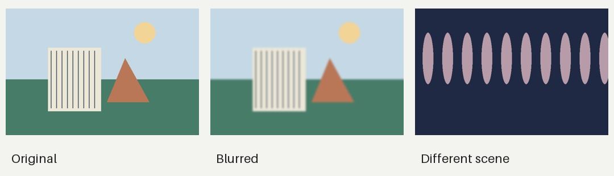

# Photo Select Lab

A small tool for sorting through a folder of similar photos. It groups likely
duplicates and makes a contact sheet so you can compare them without opening
everything separately.



## Give it a try

Python 3.11+, NumPy, and Pillow.

```bash
python -m pip install -r requirements.txt
python review.py examples/demo --output outputs/demo
```

Open `outputs/demo/index.html`. You'll get thumbnails, groups, and a CSV with
the image stats. The demo images are just generated shapes and colors.

For another folder:

```bash
python review.py /path/to/photos --output outputs/my-photos
```

Use an empty output folder outside the photo folder. The originals stay as they
are. Reports contain thumbnails and filenames, so keep them local if the photos
are private.

## What's going on

Exact copies are easy: compare file hashes. For similar images, it uses a small
image hash plus color and aspect ratio. Every image in a group has to match the
others, which helps avoid one huge group of vaguely similar pictures.

Within each group, sharper images come first. That's a starting point, not a
verdict. A perfectly sharp photo can still be the one you don't want.

The [notebook](notebooks/review_baseline.ipynb) walks through blur, color, and a
few grouping settings. You'll need Jupyter if you want to run it yourself.

## Speed check

Run `python benchmark.py` to time scanning and grouping on throwaway generated
images. It prints your machine details and median times for a few batch sizes.
These shapes are useful for timing, but a real photo folder may behave differently.

## Things I'd like to add

- Compare this with image embeddings on real duplicate pairs.
- Learn from which shots someone actually chooses to keep.
- Bring over the useful parts of my local face-swap/editing GUI: clip selection,
  mask previews, before/after comparison, and render progress.

That GUI started as an AI-assisted side project around existing models. The
public version still needs some work. Model connections will be optional, so
trying the viewer won't mean downloading half a hard drive first.

For now, this works best on one shoot at a time. Big crops, rotation, and major
lighting changes can confuse the grouping. No RAW support yet.

Code: MIT. No personal photos, generated personal edits, or model weights are
included.
